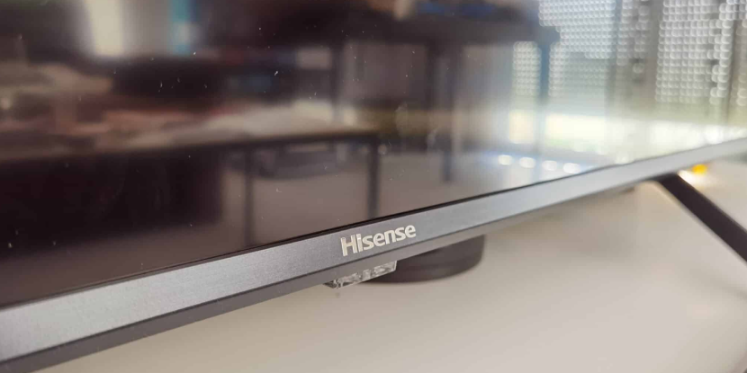

## HISENSE U7QF GUIDE

  

Aenean non euismod odio. Suspendisse mollis tincidunt mattis.

<!-- ----------------------------------------------------------------------------------------------------- -->

## UPDATE THE FIRMWARE

  

#### GATHER LATEST RELEASE

1. Launch the [4pda.to](https://4pda.to/forum/index.php?s=&showtopic=1001258&view=findpost&p=98936543) russian forum
1. Reveal the firwmare list by clicking on the **(Прошивки)** link
1. Ensure you clicked on the link with the most recent serials
1. Reveal the link by clicking on the **(+)** link
1. Ensure you clicked on the revealed link
1. Ensure the firmware file is downloaded

#### CREATE USB DRIVE WITH FIRMWARE

1. Ensure the usb drive is formated with **fat32**
1. Ensure you copied firmware archive on the usb drive
1. Ensure the firmware is named like **usb_MICALIDVB6886_U4.bin**
1. Unplug the usb drive

#### UPDATE TELEVISION FIRMWARE

1. Ensure all usb ports from the television are free
1. Ensure you plugged the usb drive correctly
1. Reveal the **CHANGE_ME** submenu
1. Tap on the **CHANGE_ME** button
1. Select the file to launch the update process
1. Ensure the device has rebooted
1. Reveal the **CHANGE_ME** submenu
1. Tap on the **reset to the factory settings** button

<!-- ----------------------------------------------------------------------------------------------------- -->

### CHANGE PICTURE SETTINGS

  

